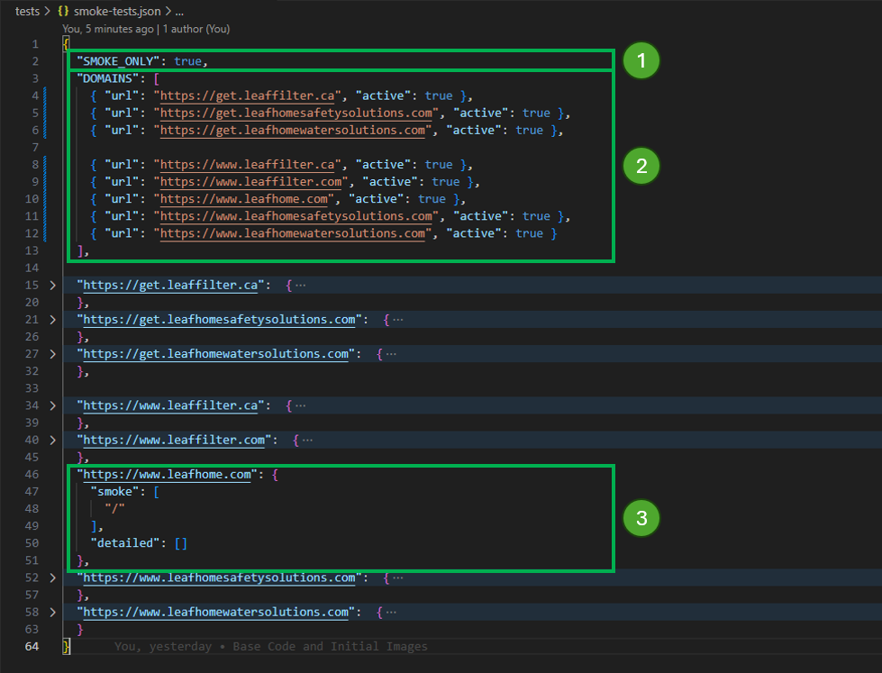
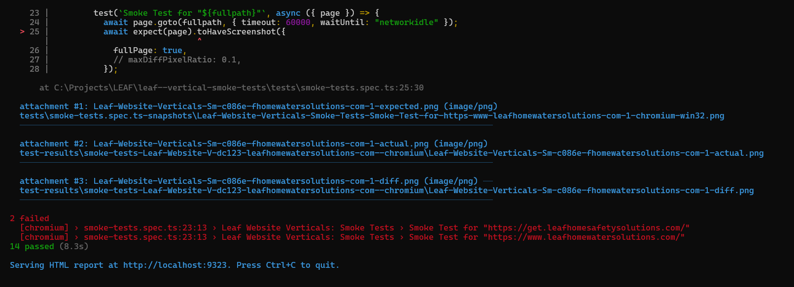

# Verticals: Smoke Tests

## Management

This tool is intended to be run before and after a release.

1. `SMOKE_ONLY` attribute.
    
    a. Set to `true`, only the `smoke` string arrays are added to the domains when running the test.
    b. Set to `false`, both `smoke` and `detailed` string arrays are added to the domains when running the test.

2. `DOMAINS` attribute. This is the array of domains to test. If `active` is false, the domain tests are not run.
3. `[domain key]` attribute (e.g. `https://www.leafhome.com`). This object contains a `smoke` array of string (to be added to the domain `url`) and `detailed` array of string.



## Process

The intent for a release is to ...

1. Update the list of domains to be targeted.
2. Move the current `smoke` domains to `detailed` array (for more extensive testing, if needed).
3. Fill in the `smoke` paths needed to properly test the release.
4. Run the tests before the domains are updated.
5. Run the tests after the domains are updated.
6. Open the report and evaluate any test failures (failure means that there was something different between the before and after) to determine if the changes are acceptable.
7. Merge the code and snapshots into the repository.

### Process Run

For steps **4 and 5**, you will enter `npx run test` in the CLI.

A run with failure (something needs evaluated) looks like this.



The report is automatically opened. Clicking on a failure takes you to another screen.

At the bottom of that screen is a view where the change is highlighted in red.


There are five options for evaluation.

1. Diff (overlayed with red highlighting the differences)
2. Actual (new snapshot)
3. Expected (old snapshot)
4. Side by side (both)
5. Slider (allows dragging horizontally to expose the differences)

## Usage

## Configuration

There is a `smoke-tests.json` file that contains:

* A `SMOKE_ONLY` boolean that tells the suite to use a smaller set of data.
* The list of domains and for each domain, `smoke` and `detailed` list of pages.

## Commands

### Updates the snapshots

```script
npm run update-snapshots
```

### Runs the end-to-end tests.

```script
npm run test
```

... OR ...

```script
npx playwright test
```

### Starts the interactive UI mode.

```script
npx playwright test --ui
```

### Runs the tests only on Desktop Chrome.

```script
  npx playwright test --project=chromium
```
